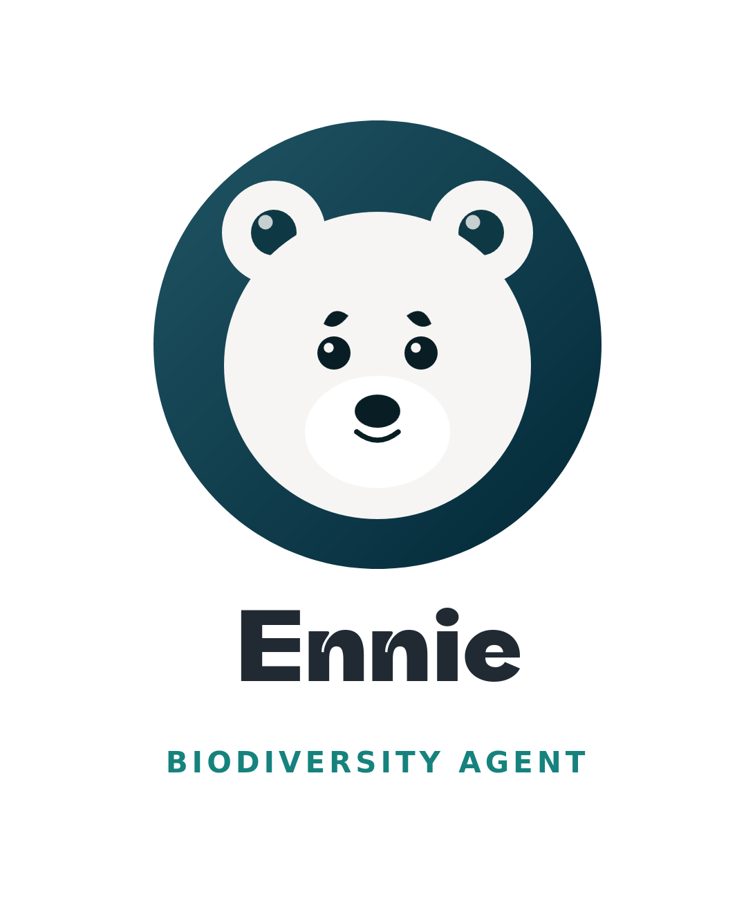
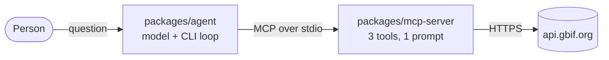

<p align="center">
  
</p>

[](https://github.com/tahgio/ennie-agent/actions/workflows/ci.yml)

## Description

An [MCP](https://modelcontextprotocol.io) server over [GBIF](https://www.gbif.org), the global
biodiversity occurrence index, plus a small command-line agent that consumes it.

GBIF holds well over two billion species occurrence records. Exposing a raw search endpoint and
letting a model page through them burns the context window on records nobody reads. This server
asks GBIF to do the aggregating instead, and returns counts. Three tools cover the surface:
`resolve_taxon` turns a name into one accepted GBIF taxon (or a recoverable question, for a
homonym or a misspelling); `summarize_occurrences` answers distribution questions — by country,
year, basis of record — from GBIF's own faceting, in one request and a bounded response no matter
the species; `search_occurrences` returns a capped page of individual records when someone actually
wants to see them. One prompt, `species_distribution_report`, sequences the three for the common
case.

## Requirements

- Node 24+ (`node --version` → v24.x)
- pnpm 11+
- **No GBIF account.** Every endpoint used is anonymous.
- One model API key — Anthropic, OpenAI, or Google — but only to run the bundled agent. The server
  itself needs no credentials at all.

## Quickstart

```bash
pnpm install
pnpm build

cp .env.example .env       # set MODEL and one matching provider key
pnpm agent
```

`MODEL` takes two forms: `provider:model` goes direct through that provider's SDK (`anthropic`,
`openai`, `google`), and `provider/model` goes through the
[Vercel AI Gateway](https://vercel.com/docs/ai-gateway) using `AI_GATEWAY_API_KEY`.

Nothing about the server is specific to the bundled agent — any MCP client can add it by path:

```json
{ "mcpServers": { "gbif": { "command": "node", "args": ["/absolute/path/to/packages/mcp-server/dist/index.js"] } } }
```

### Testing

```bash
pnpm test         # unit + protocol. Offline, deterministic, and what CI runs.
pnpm test:live     # hits api.gbif.org for real — no key needed, but it's someone else's server
pnpm eval          # runs the 12 eval scenarios through a real model — this one costs money
```

## Highlights

Four real runs against the bundled CLI agent (`claude-haiku-4-5`) unedited.

**Resolving a name to its accepted taxon.** A common or scientific name in, one accepted GBIF
taxon out.


**A distribution question answered by faceting, not paging.** One upstream request, a ranked
country breakdown, no individual records transported.


**A bounded page of individual records**, capped locally and always reporting the total left
unseen.


**The cross-kingdom homonym guard.** *Prunella* is both a bird and a mint — the server refuses to
guess and asks which is meant, listing both candidates.


## Tech Architecture



| Decision | Why                                                                                                                                                                                                                                              |
|---|--------------------------------------------------------------------------------------------------------------------------------------------------------------------------------------------------------------------------------------------------|
| **Aggregation over passthrough** | The server asks GBIF to facet and count server-side, rather than exposing raw search for a model to page through. This is what keeps a distribution answer's size constant whether the species has a hundred occurrences or twenty-five million. |
| **stdio-only boundary between agent and server** | `packages/agent` has no workspace import of `packages/mcp-server` — it spawns the built server as a child process over stdio, exactly like a third-party client would. A lint rule enforces it, so the protocol boundary is real.                |
| **A bounded 3-tool surface, not a generic wrapper** | `resolve_taxon`, `summarize_occurrences`, `search_occurrences` — each with a distinct, schema-enforced response shape — instead of one passthrough call a model has to parameterise correctly every time.                                        |
| **No transport baked into the core** | `createServer()` knows nothing about stdio or HTTP; `index.ts` is the stdio entrypoint and does nothing else. Adding a second transport will be as easy as adding a new file.                                                                    |

Two operator-facing env vars tune GBIF politeness: `GBIF_USER_AGENT_CONTACT` (an email appended to
the outbound `User-Agent`) and `GBIF_CALL_BUDGET_MS` (the total time one tool call gets against
GBIF, default 60s).

The full decision record — including the four verified GBIF API quirks that shaped the domain
logic, dependency pinning, and cache-eviction policy — is in
[specs/001-gbif-mcp-server/research.md](specs/001-gbif-mcp-server/research.md).

## Next Work

- [ ] **HTTP/SSE transport.** Add a network transport alongside stdio so the server can be reached
      by clients that can't spawn a child process. The core already knows nothing about transport,
      so this will be a new entrypoint file.
- [ ] **Deeper LLM-as-judge eval coverage.** Expand the eval suite's judge-model scenarios beyond
      the current 12, covering more failure modes (homonyms, contradictory input, empty results) so
      answer *quality* is tracked over time.
- [ ] **Domain-relevance input guardrail.** A fast, cheap pre-check that flags questions unrelated
      to biodiversity/occurrence data before they reach the main model, so an off-topic prompt
      doesn't burn a full generation and a tool call.
- [ ] **Complexity-based model routing.** Route simple, single-tool lookups to a fast/cheap model
      and multi-step or ambiguous queries to a stronger one, trading latency and cost against depth
      per request instead of one fixed model for every question.
- [ ] **Output-vs-data comparator.** Check the agent's final prose answer against the structured
      tool results it actually received (e.g. flag a country ranking in the text that doesn't match
      what `summarize_occurrences` returned), to catch narration drifting from ground truth.

## License

MIT — see [LICENSE](LICENSE).
